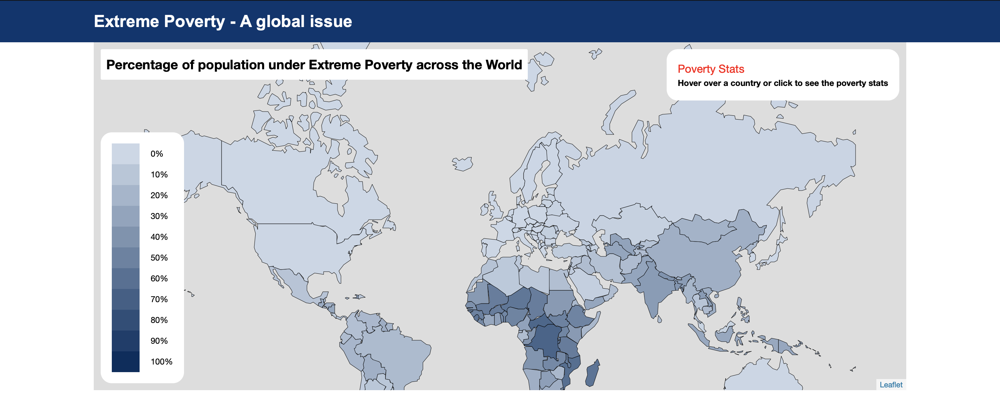

### Understanding Extreme Poverty and Various Factors Involved with it

## Overview

This prototype is developed to understand extreme poverty around the world/countries and various factors associated with it. The World Bank has introduced various poverty indicators/gaps to define extreme poverty. This tool allows the user to understand the global as well country-wise trend for the extreme poverty indicators and also the relationship between extreme poverty and different factors like GDP per capita, employment and school enrollment.

This tool comprises of a choropleth map, line charts and scatter plots. Map is used for showing the population density living under extreme poverty (mean poverty $1.90 per day), line charts are used to show the global as well as country wise trend of the poverty indicators and scatter plots show the correlation between poverty indicators and the factors mentioned above.

The dashboard is developed using JavaScript libraries, i.e. D3.js, Leaflet, and React. React was used to build the components, D3.js helped to build the line charts and scatter plots and Leaflet used to build the Choropleth map. Data to build the prototype is collected from the World Bank and OECD (The Organisation for Economic Co-operation and Development) open data catalogue.

## Install D3 and React 

D3 <https://d3js.org>
React <https://reactjs.org>

## Dashboard(Prototype) Link

Visualization dashboard is available here <https://povertyviz.herokuapp.com>.

## Video Link

Link for the short video clip explaining the project is here <https://www.youtube.com/watch?v=g8DhfJEjuLM>.

## References

<https://leafletjs.com/examples/choropleth/>
<https://react-leaflet.js.org>
<https://github.com/facebook/create-react-app>
<https://reactjs.org/docs/getting-started.html>
<https://reactjs.org/docs/getting-started.html>
<https://medium.com/@caspg/responsive-chart-with-react-and-d3v4-afd717e57583>